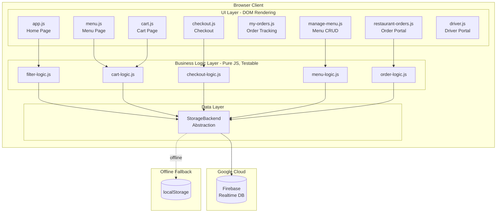
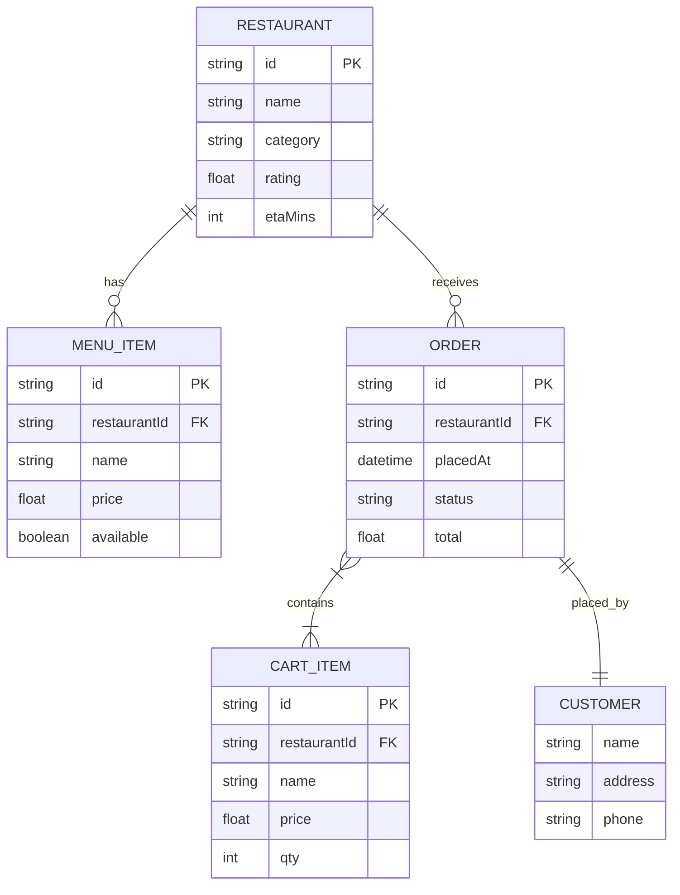
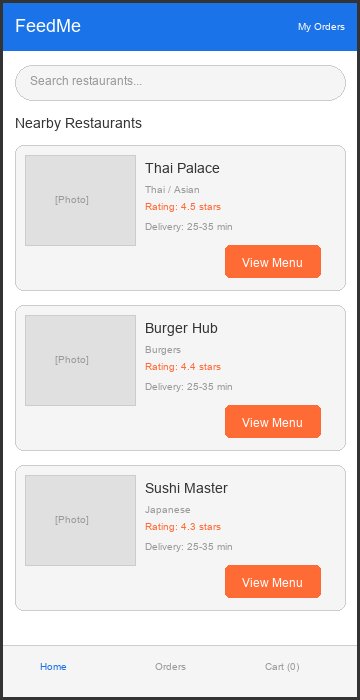
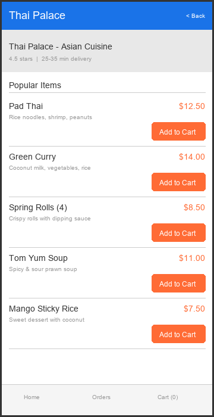
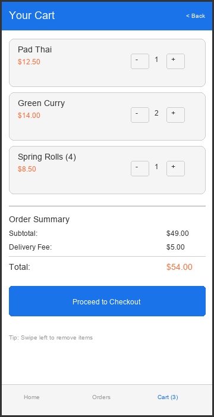
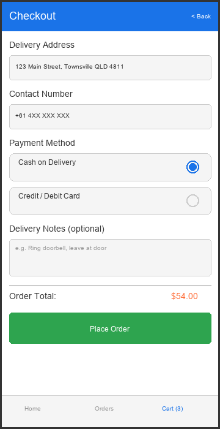
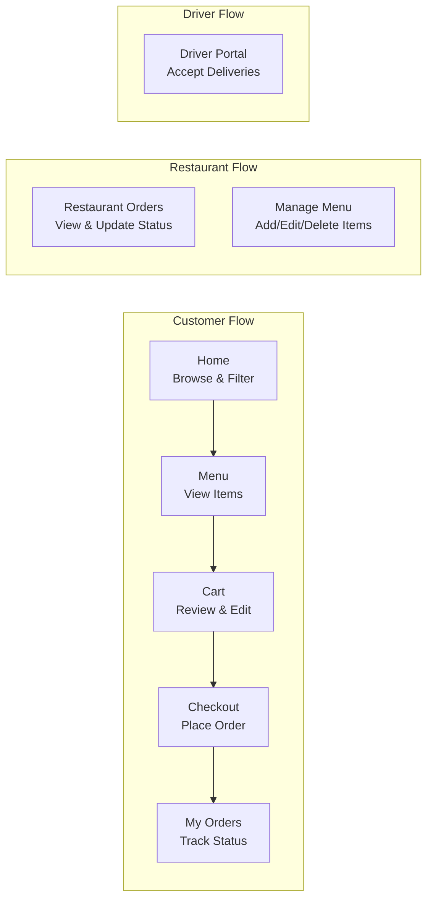
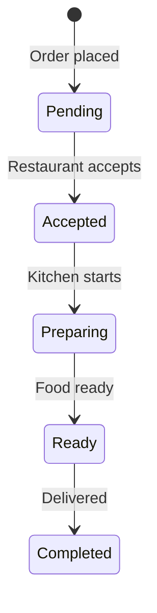

# 2. Design — Architecture, Database & Interface

## Architectural Design

FeedMe uses a **layered client-side architecture** with a clear separation between UI rendering, business logic, and data persistence. This follows the **Humble Object** pattern (textbook Ch 5) to keep business logic pure and testable.

*Diagram created with [Mermaid Live Editor](https://mermaid.live) — an online UML diagram tool.*

### Layer Descriptions

| Layer | Responsibility | Testable? |
|-------|---------------|-----------|
| **UI Layer** | DOM manipulation, event handling, page rendering | No (DOM-coupled) |
| **Business Logic** | Cart operations, validation, filtering, order management | Yes — 100% coverage via Jest |
| **Data Layer** | StorageBackend abstraction over Firebase + localStorage | Swappable backends |
| **Cloud** | Firebase Realtime Database (Google Cloud, Asia SE region) | Real-time sync |
| **Fallback** | localStorage when Firebase unavailable | Offline-capable |

### Design Justification

The Humble Object pattern was chosen because:
1. **Testability** — Business logic is pure JavaScript with no DOM or browser dependencies, enabling 100% unit test coverage
2. **Swappable persistence** — The StorageBackend abstraction allowed adding Firebase in iteration 2 without changing any business logic
3. **Simplicity** — No framework overhead; the app deploys as static files to GitHub Pages

---

## Database Design

*Diagram created with [Mermaid Live Editor](https://mermaid.live) — an online database diagram tool.*

### Storage Keys (Firebase paths / localStorage keys)

| Key | Structure | Purpose |
|-----|-----------|---------|
| `feedme_cart` | `[{ id, name, price, qty, rid, restaurantName }]` | Active shopping cart |
| `feedme_orders` | `[{ id, placedAt, customer, restaurantId, items, total, status }]` | Order history |
| `feedme_menus` | `{ [rid]: [{ id, name, price, available }] }` | Custom menu overrides |
| `feedme_driver_assignments` | `[{ orderId, driverId, assignedAt }]` | Driver delivery history |

### Seed Data (JSON files)

| File | Structure | Records |
|------|-----------|---------|
| `restaurants.json` | `[{ id, name, category, rating, etaMins }]` | 3 restaurants |
| `menus.json` | `{ [rid]: [{ id, name, price }] }` | 3 items per restaurant |

---

## Interface Design

*Prototype built as working HTML/CSS/JS pages — the live prototype IS the interface design. Screenshots taken from the deployed [GitHub Pages site](https://jarrode.github.io/CP3407_Advanced-Software-Engineering/prototype/).*

### UI Wireframes

*Wireframes created with [Excalidraw](https://excalidraw.com) — an online prototyping and whiteboard tool. Source files stored in `docs/wireframes/`.*

Early-stage wireframes were created to plan the layout and user flow before implementation. These guided the visual structure of each page:

| Wireframe | Key Elements | Implemented Page |
|-----------|-------------|-----------------|
|  | Search bar, restaurant cards with ratings/ETA, bottom nav | `index.html` |
|  | Restaurant header, item list with prices, Add to Cart buttons | `menu.html` |
|  | Item list with quantity controls, order summary, checkout button | `cart.html` |
|  | Delivery address, payment method, delivery notes, Place Order | `checkout.html` |

The wireframes established the core layout patterns that carried through to the final implementation: card-based restaurant listings, a persistent bottom navigation bar, and a linear customer flow (Home → Menu → Cart → Checkout → My Orders).

### Page Map & User Flows

### All Pages

| Page | File | User Stories | Role |
|------|------|-------------|------|
| Home (Browse) | `index.html` | US-01, US-02 | Customer |
| Menu | `menu.html` | US-02, US-03 | Customer |
| Cart | `cart.html` | US-03, US-04 | Customer |
| Checkout | `checkout.html` | US-05 | Customer |
| My Orders | `my-orders.html` | US-09 | Customer |
| Manage Menu | `manage-menu.html` | US-06 | Restaurant |
| Restaurant Orders | `restaurant-orders.html` | US-07, US-08 | Restaurant |
| Driver Portal | `driver.html` | US-10 | Driver |

### UI Design Principles
- **Dark theme** with CSS custom properties (`--accent: #ff6b35`) for consistent theming
- **Card-based layout** with hover animations (`@keyframes fadeIn`) for restaurant and menu items
- **Pill-shaped navigation** bar for role switching (Customer / Restaurant / Driver)
- **Badge system** for metadata (price, rating, ETA, status)
- **Colour-coded statuses**: pending (amber), accepted (blue), preparing (purple), ready (green), completed (grey)
- **Responsive design** with CSS Grid/Flexbox and mobile breakpoints
- **Toast notifications** for user feedback (e.g., "Added to cart!")

### Order Status Flow

---

## Technology Choices

| Concern | Choice | Rationale |
|---------|--------|-----------|
| Language | Vanilla JavaScript (ES6+) | No framework overhead, deploys as static files |
| Styling | Custom CSS with variables | Lightweight, no build step needed |
| Cloud DB | Firebase Realtime Database | Free tier, real-time sync, client-side SDK |
| Fallback | localStorage | Offline-capable when Firebase unavailable |
| Hosting | GitHub Pages | Free, automatic deployment from main branch |
| Testing | Jest | Industry-standard, fast, good coverage |
| CI/CD | GitHub Actions | Automated tests on every push |
| Linting | ESLint | Static analysis for code quality |
