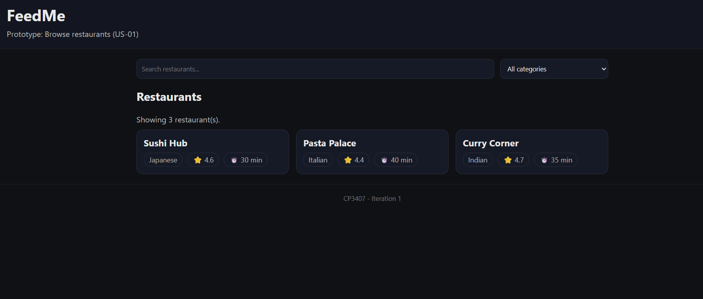

# User story title: Browse restaurants
Other title versions: Display restaurant list, Show restaurants

## Priority: 10
Baseline MVP capability for customers.

## Estimation: 1 day
Planning poker / estimates:
* Jarrod: 1 day (before iteration-1)

## Assumptions (if any):
- Restaurant list data exists (seeded or mocked) for iteration-1.
- Authentication is not required for browsing.

## Description
Description-v1: The app will show a list of restaurants so the customer can choose where to order from.

## Tasks (see chapter 4)
- [x] [done] Create restaurant list page/screen (0.50 days)
- [x] [done] Provide basic data source (seed/mock JSON) (0.25 days)
- [x] [done] Add search + category filter (0.25 days)

# UI Design
- Add a screenshot/mockup here (later).

## Completed-v1 (Iteration 1)
- Date: 2026-02-15
- Evidence:
  - Restaurant list prototype running (Live Server)
  - Screenshot: 
