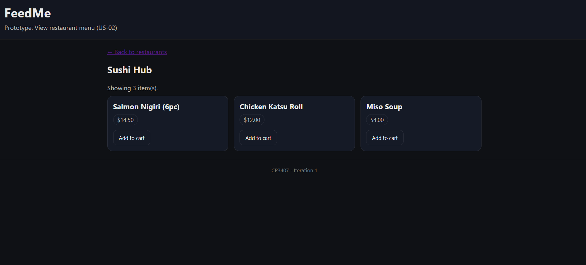

# User story title: Add items to cart
Keep any other version here as well, e.g. Add menu item to cart, Create cart.

## Priority: 10
Baseline MVP ordering capability.

## Estimation: 1 day
Any notes on estimation go here. Keep your planning poker game numbers.
* Jarrod: 1 day (estimated before iteration-1)

## Assumptions (if any):
- Menu items have id/name/price.
- For Iteration 1 prototype, cart can be client-side only.

## Description
You need to keep all versions here so that your instructor/marker can see your changes easily.

Description-v1: Customer can add menu items to a cart so they can prepare an order before checkout.

## Tasks, see chapter 4.
- [x] [done] T1 Add “Add to cart” button (0.5 days) — evidence screenshot: ../docs/screenshots/us03_t1_add_to_cart_button.png
- [ ] [todo] T2 Persist cart in localStorage (0.5 days)
- [ ] [todo] T3 Cart page: list + total (1.0 days)
- [ ] [todo] T4 Clear cart + basic UX (0.5 days)

# UI Design:
* Insert a mockup design screenshot (later).

# Completed:
## Completed-v1 (Iteration 1)
- Date: 2026-02-22
- Evidence:
  - 